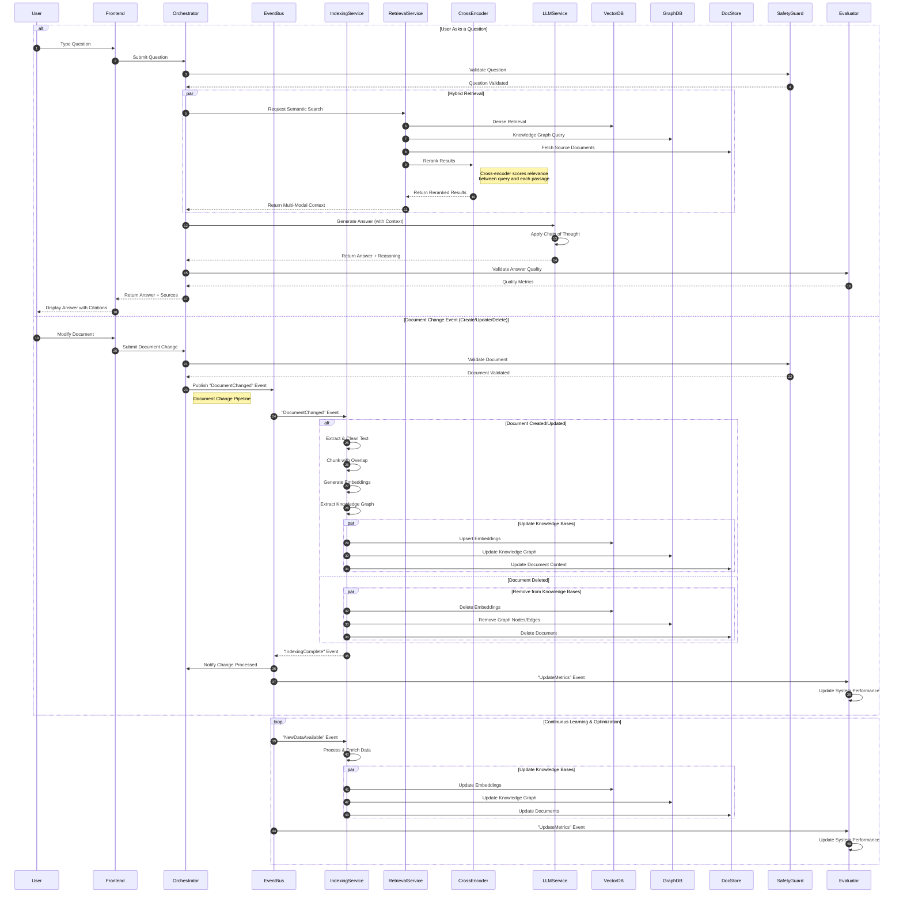

# 👀 TaxSEE! (YSWIDT?) 

TLDR: 🚀
Implementations:
- 🔨 Simple: A simple GraphRAG in 1000 lines (AND A RAG ENGINE to build future RAG applications ~ WIP), one file at [app.py](app.py) and it uses Neo4j and FAISS. (Used Milvus initially but switched)
- 🏗️ Complex: A Config driven RAG engine that allows building pipelines for RAG in a plug and play manner (It has all the tests for the raw APIs and interfaces) - See [rag_engine/](rag_engine/)
Resources:
- 📚 [resources.md](resources.md) - Many things I read and referred to in learning 

✨ This implementation demonstrates a cutting-edge approach to Retrieval-Augmented Generation (RAG) combining multiple SOTA techniques for maximum accuracy and performance - It kinda works! 🎉

### 🎯 Key Features

- **Hybrid Search Architecture**
  - FAISS vector search with cosine similarity
  - Neo4j graph database for relationship understanding
  - Cross-encoder re-ranking for precision
  - Parallel processing for high-performance ingestion

- **Advanced Document Processing**
  - Multi-format support (PDF, CSV, PPTX)
  - Intelligent chunking with overlap
  - Parallel batch processing
  - Memory-efficient streaming

- **Production-Ready Features**
  - Session isolation for security
  - Auto-cleanup for privacy
  - Progress monitoring
  - Error handling and recovery

### 🏗️ Architecture Deep Dive

#### 1. Document Ingestion Pipeline
- **Parallel Processing**: Uses ProcessPoolExecutor for CPU-intensive tasks
- **Batch Optimization**: Dynamic batch sizing based on available cores
- **Memory Management**: Streaming approach for large files
- **Vector Normalization**: L2 normalization for stable cosine similarity

#### 2. Search Implementation
- **Primary Search**: FAISS with IndexFlatIP for fast cosine similarity
- **Secondary Search**: Neo4j graph traversal for relationship context
- **Re-ranking**: Cross-encoder for high-precision result refinement
- **Result Fusion**: Weighted combination of vector and graph results

#### 3. Performance Optimizations
- **Caching**: Strategic use of Streamlit caching for models
- **Resource Management**: Dynamic worker allocation
- **Batch Processing**: Optimal chunk sizes for parallel processing
- **Memory Efficiency**: Stream processing for large documents

### 🤔 Key Design Decisions

1. **Vector Search Implementation**
   - Chose FAISS over Milvus (tried but didn't like)
     * Better performance at scale
     * Memory efficiency
     * Cosine similarity support
   
2. **Graph Database Choice**
   - Selected Neo4j for:
     * Native graph operations
     * Relationship modeling
     * Query flexibility

3. **Re-ranking Strategy**
   - Implemented cross-encoder because:
     * Higher accuracy than bi-encoders
     * Better semantic understanding
     * Worth the computational trade-off

4. **Processing Architecture**
   - Parallel processing with:
     * Process-based parallelism for CPU tasks
     * Thread-based for I/O operations
     * Dynamic batch sizing

Instructions to run the repo:
- `./setup_dev.sh`
- `pip install -r requirements.txt`
- `streamlit run app.py`

Dataset:
    - Test datasets in `evals/`:
        - Hand-curated test cases
        - Synthetic data generation
        - Decent coverage

# Raw RAG Thoughts and Notes

## What is this?
A lightweight implementation of Retrieval Augmented Generation (RAG) that focuses on simplicity and practicality. Built after experimenting with various approaches and learning what actually works.

## Architecture
### Key Components:
- **FAISS**: Chosen over Milvus after real-world testing with large files
- **Neo4j**: For graph relationships (optional component) 
- **Cross-Encoder**: For better result ranking

## Engineering Decisions & Learnings

### 🔄 From Milvus to FAISS
Started with Milvus + Attu (looked promising!) but switched to FAISS when Milvus struggled with a 7000-page PDF. FAISS is simpler, lighter, and just works.

### 📄 The PDF Challenge
PDF parsing is surprisingly hard! Tested multiple libraries, ended up with a practical compromise using pdfplumber for decent speed/accuracy balance.

### 💡 Interesting Discoveries
- PPTx files are actually zip files (mind = blown)
- Experimented with Ollama + Llama 3.2 vision for metadata extraction
- Tried Gemini 1.5 Pro for chunk reorganization (interesting but slow)

## RAG ENGINE - A WIP standalone engine for building pluggable and playable RAGs based on config (rag_engine/run_pipeline.py)
### The Gemini Experiment
An experimental approach for high accuracy:
1. Load batch of chunks into memory
2. Send to Gemini 1.5 Pro
3. Ask Gemini to reorganize for coherence and add metadata and relationships and cypher queries
4. Execute those cypher queries on Neo4j, in time and accurate knowledge graph building pipeline
Inspired by Late Chunking and Anthropic's Contextual Embedding concept

## Current Limitations
- Large files are still challenging (working on it!)
- Requires OpenAI API key (local LLM support planned)
- Could use better CSV handling (SQL approach in progress)
- Needs Multimodal support for things like PPT and PDF parsing and there are 100s of solutions out there and yet they not good

## Designing solution for large scale RAGs

Things I read and referred to in learning are shared in [resources.md](resources.md) - Many thanks to those who shared their learnings!